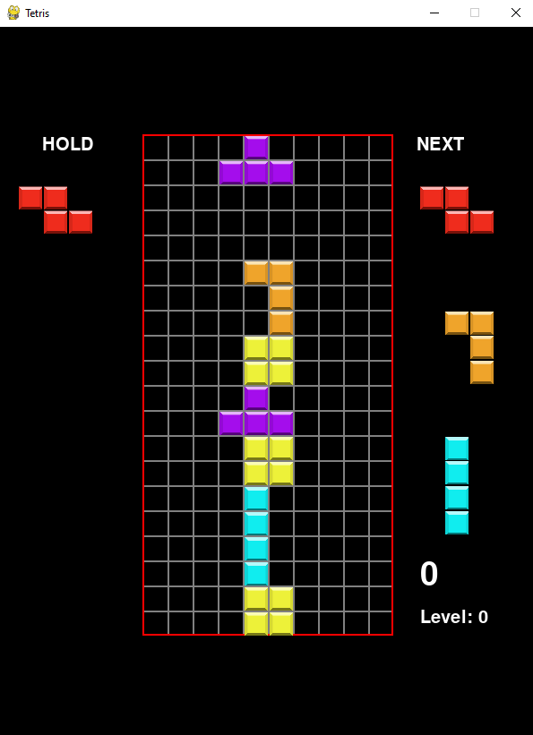

# Python-Tetris

Classic 2D Tetris game built with python and pygame. 

<p align='center'>
	
</p>

# Requirements

Use the package manager [pip](https://pip.pypa.io/en/stable/) to install following packages :-
* Pygame

```bash
pip install pygame
```
## How to play

Double click the main.py file to open the game. It will start automatically.

Controls:
* Use **Left** arrow key to move left and **Right** arrow key to move right.
* Use **Down** arrow key to fall faster.
* Use **Up** arrow key to rotate the figures.
* Use **Space** to fall instantly.
* Press **P** to pause or unpause the game.
* Press **Esc** or **q** to quit the game.
